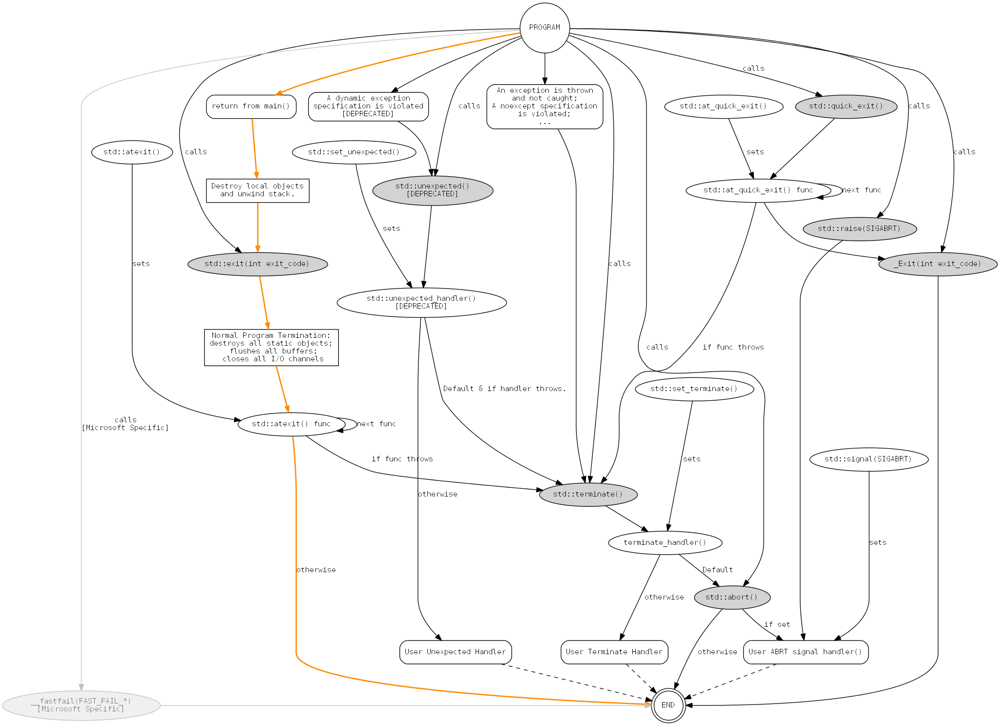

Terminators 
===========

A GraphViz diagram that shows both normal and unexpected program termination flows in C++. 

There are multiple ways a C++ program may terminate. These include both normal and unexpected termination.  
This GraphViz diagram shows the program termination flows as defined by the standard. 

C++ program terminators include:
* [`std::exit()`](http://en.cppreference.com/w/cpp/utility/program/exit)
* [`std::quick_exit()`](http://en.cppreference.com/w/cpp/utility/program/quick_exit)
* [`std::_Exit()`](http://en.cppreference.com/w/cpp/utility/program/_Exit)
* [`std::abort()`](http://en.cppreference.com/w/cpp/utility/program/abort)
* [`std::terminate()`](http://en.cppreference.com/w/cpp/error/terminate)
* [`std::unexpected()` (deprecated)](http://en.cppreference.com/w/cpp/error/unexpected)

The graph is somewhat incomplete as there some subtle contexts and conditions that are not explicitly stated, and there is no explicit distinction between
the C and C++ versions of some of the functions (e.g. `exit()`).  
It does attempt to show the important functions and calls.

Corrections, additions, updates and layout improvements will be gladly accepted.